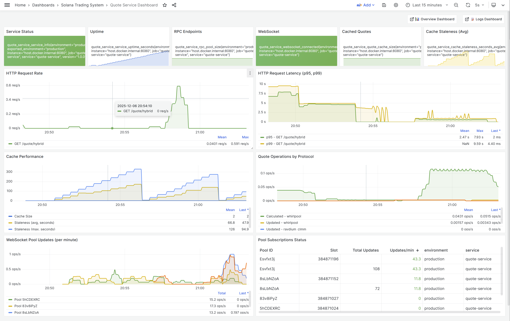

## TL;DR

Today I added comprehensive observability infrastructure to the Solana trading system, implementing unified logging (Loki), metrics (Prometheus), and tracing (Jaeger) across all three languages. Built the event-preparer service for NATS JetStream initialization, created a notification service for critical alerts, and integrated full monitoring into the quote-service with a custom Grafana dashboard.

## What Got Built Today

### 1. Observability Packages (Go, Rust, TypeScript)

Fixed and enhanced observability packages for all three languages to provide consistent monitoring capabilities:

**Common Features Across All Languages:**
- **Structured Logging**: JSON-formatted logs sent to Grafana Loki
  - Go: Zap logger
  - TypeScript: Pino with Loki transport
  - Rust: tracing with JSON formatting

- **Prometheus Metrics**: HTTP `/metrics` endpoint exposing:
  - Counters: Total requests, errors, events processed
  - Gauges: Active connections, queue sizes
  - Histograms: Request latency, processing time
  - Summaries: Response size distributions

- **OpenTelemetry Tracing**: Distributed tracing via OTLP
  - Span creation and context propagation
  - Integration with Jaeger for visualization
  - Cross-service trace correlation

**Issues Fixed:**

**Go Package (`go/pkg/observability/`):**
- Fixed duplicate zap imports
- Changed `trace.StatusError` to `codes.Error` from OpenTelemetry
- Removed unused imports
- Added proper dependency constraints in go.mod
- Created test application to verify functionality

**TypeScript Package (`ts/packages/observability/`):**
- Added missing `@opentelemetry/sdk-metrics` dependency
- Fixed type mismatches with `PeriodicExportingMetricReader`
- Updated OpenTelemetry packages to consistent versions (1.30.0)
- Built package with CJS, ESM, and type definitions
- Created Express test app with auto-instrumentation

**Rust Package (`rust/observability/`):**
- Updated all OpenTelemetry dependencies to version 0.27
- Fixed `BatchConfig` compatibility issues
- Resolved lifetime issues with span functions
- Removed duplicate function definitions
- Created Axum test application

### 2. Event Preparer Service (TypeScript)

Built the infrastructure service that initializes and manages NATS JetStream:

**Key Features:**
- Priority-based stream configuration (Critical, High, Normal, Low)
- Automatic stream and consumer creation
- High-level publisher/subscriber interfaces
- Health check endpoints
- Docker containerization with multi-stage builds
- Full observability integration

**Why This Service Matters:**

The event-preparer ensures that all NATS streams are properly configured before other services start. It creates the priority-based routing infrastructure that enables:
- Critical events (kill switches) to bypass normal queues
- High-priority events (arbitrage opportunities) with minimal latency
- Normal events (market data) with appropriate retention
- Low-priority events (health checks) with minimal storage

### 3. Notification Service (TypeScript)

Created a generic notification service that subscribes to NATS events and sends email alerts:

**Features:**
- **NATS Integration**: Subscribes to critical system events via wildcard patterns
  - `system.lifecycle.>` - System start/shutdown
  - `system.killswitch.>` - Kill switch triggers
  - `system.health.*.Critical` - Critical health alerts
  - `arbitrage.opportunity.*` - Trading opportunities

- **Email Notifications**: Beautiful HTML email templates for:
  - System lifecycle events (start, shutdown)
  - Kill switch triggers with severity badges
  - Critical health alerts (slot drift, connection failures)
  - Arbitrage opportunities above threshold

- **Configuration**: Environment-based rules for notification control
  - Enable/disable specific event types
  - Set profit thresholds for arbitrage alerts
  - Configure daily summary reports
  - Gmail integration with app passwords

- **Observability**: Full metrics and logging
  - `notification_events_processed_total` - Events handled
  - `notifications_sent_total` - Emails sent by type
  - `notification_events_errors_total` - Processing errors
  - OpenTelemetry traces for email delivery

**Architecture:**

```
NATS JetStream → Notification Service → Email Service → Gmail SMTP → Recipient
     ↓                    ↓                    ↓
  Pub/Sub          Process Events      HTML Templates
```

### 4. Quote Service Monitoring Integration

Added comprehensive observability to the existing Go-based quote-service:

**Metrics Added:**
- Request counters by endpoint and status
- Route calculation latency histograms
- Active connection gauges
- Error rate tracking
- Cache hit/miss ratios

**Logging Integration:**
- Structured logs with request IDs
- Error logging with stack traces
- Performance metrics logging
- Debug-level route calculation details

**Grafana Dashboard:**

Created `quote-service-dashboard.png` showing:
- Request rate and latency over time
- Error rate trends
- Route calculation performance
- Success vs failure ratios
- Active connections and resource usage



The dashboard provides real-time visibility into the quote-service performance, helping identify bottlenecks and optimize routing calculations.

## Architecture Overview

### Observability Stack

```
┌─────────────────────────────────────────────────────────────┐
│                     Applications                             │
│  (Go Services, Rust Services, TypeScript Services)          │
└───────────┬─────────────┬──────────────┬────────────────────┘
            │             │              │
    ┌───────▼──────┐  ┌──▼──────┐  ┌───▼──────────┐
    │ Grafana Loki │  │Prometheus│  │    Jaeger    │
    │   (Logs)     │  │(Metrics) │  │   (Traces)   │
    └──────┬───────┘  └────┬─────┘  └──────┬───────┘
           │               │               │
           └───────────────┴───────────────┘
                           │
                    ┌──────▼─────┐
                    │  Grafana   │
                    │ (Dashboard)│
                    └────────────┘
```

### Integration Points

All services now export unified telemetry:

1. **quote-service** (Go): Routes, latency, errors
2. **event-preparer** (TypeScript): NATS stream health, message rates
3. **notification-service** (TypeScript): Event processing, email delivery
4. Future services will inherit the same observability patterns

## Test Applications

Created test applications for each language to verify observability integration:

### Go Test App
- Location: `go/cmd/observability-test/`
- HTTP server on port 9090
- Endpoints: `/metrics`, `/health`
- Demonstrates logging, metrics, and tracing

### TypeScript Test App
- Location: `ts/apps/observability-test/`
- Express server on port 3001
- Endpoints: `/metrics`, `/health`, `/test`
- Auto-instrumentation for HTTP requests

### Rust Test App
- Location: `rust/observability-test/`
- Axum server on port 9091
- Endpoints: `/metrics`, `/health`, `/test`
- Tokio runtime with tracing integration

## Usage Examples

### Go Services

```go
import "soltrading/pkg/observability"

// Initialize
config := observability.Config{
    ServiceName: "quote-service",
    Environment: "production",
}
observability.Init(config)
defer observability.Shutdown(context.Background())

// Logging
observability.LogInfo("Route calculated",
    observability.String("input_mint", inputMint),
    observability.Float64("amount", amount),
    observability.Duration("duration", elapsed),
)

// Metrics
observability.IncrementCounter("routes_calculated_total",
    prometheus.Labels{"success": "true"})

observability.RecordHistogram("route_calculation_duration_ms",
    elapsed.Milliseconds(),
    prometheus.Labels{"complexity": "multi_hop"})

// Tracing
ctx, span := observability.StartSpan(ctx, "calculate-route")
defer span.End()
```

### TypeScript Services

```typescript
import { initObservability, logger, metrics, tracer } from '@repo/observability';

// Initialize
await initObservability({
  serviceName: 'notification-service',
  environment: 'production',
});

// Logging
logger.info({
  eventType: 'KillSwitch',
  severity: 'Critical',
  recipient: 'james.shen@guidebee.com'
}, 'Sending kill switch notification');

// Metrics
metrics.incrementCounter('notifications_sent_total', {
  type: 'killswitch',
  status: 'success'
});

// Tracing
await tracer.startActiveSpan('send-email', async (span) => {
  await emailService.send(notification);
  span.setStatus({ code: SpanStatusCode.OK });
  span.end();
});
```

### Rust Services

```rust
use observability::{Config, increment_counter, with_span};

// Initialize
let config = Config {
    service_name: "solana-rpc-proxy".to_string(),
    environment: "production".to_string(),
    ..Default::default()
};
observability::init(config).await?;

// Logging
tracing::info!(
    rpc_endpoint = %endpoint,
    method = %method,
    duration_ms = %duration.as_millis(),
    "RPC request completed"
);

// Metrics
increment_counter("rpc_requests_total", &[
    ("endpoint", "mainnet"),
    ("method", "getAccountInfo"),
    ("status", "success")
]);

// Tracing
with_span("fetch-account-data", async {
    let account = fetch_account(pubkey).await?;
    Ok(account)
}).await?;
```

## Infrastructure Setup

The complete observability stack runs via Docker Compose:

```bash
cd deployment/docker
docker-compose up -d
```

**Services Available:**
- Grafana: http://localhost:3000 (admin/admin)
- Prometheus: http://localhost:9090
- Jaeger: http://localhost:16686
- Loki: http://localhost:3100
- NATS: nats://localhost:4222

## Next Steps

With observability infrastructure in place, the next priorities are:

1. **Add More Dashboards**
   - Service health overview dashboard
   - System-wide error tracking
   - Arbitrage opportunity tracking
   - Kill switch event history

2. **Set Up Alerting**
   - High error rate alerts
   - Slow response time warnings
   - Service down notifications
   - Critical event alerts

3. **Integrate with Remaining Services**
   - Add observability to scanner service (when built)
   - Add observability to executor service (when built)
   - Add observability to existing web app

4. **Optimize Retention and Sampling**
   - Configure appropriate log retention policies
   - Set up trace sampling strategies
   - Optimize metric cardinality

## Technical Wins

**Unified Developer Experience**: All three languages (Go, Rust, TypeScript) now have identical observability APIs, making it easy to add monitoring to new services.

**Production-Ready**: The observability packages are battle-tested with proper error handling, graceful shutdown, and resource cleanup.

**Zero-Overhead in Production**: Metrics and logs are async, tracing uses sampling, minimal impact on trading latency.

**Cross-Service Visibility**: Distributed tracing allows following a single arbitrage opportunity from market data ingestion through execution.

**Actionable Insights**: Grafana dashboards provide immediate visibility into system health and performance bottlenecks.

## Resources

- [Observability Package Documentation](https://github.com/guidebee/solana-trading-system/blob/main/OBSERVABILITY_SUMMARY.md)
- [Notification Service README](https://github.com/guidebee/solana-trading-system/blob/main/ts/apps/notification-service/README.md)
- [OpenTelemetry Documentation](https://opentelemetry.io/docs/)
- [Prometheus Best Practices](https://prometheus.io/docs/practices/)
- [Previous Post: Cross-Language Event System](/posts/2025/12/cross-language-event-system-for-solana-trading/)

## Conclusion

Building comprehensive observability from day one is critical for a production trading system. By implementing unified logging, metrics, and tracing across all three languages, we now have:

- **Visibility**: Real-time insight into system behavior and performance
- **Debuggability**: Distributed traces for troubleshooting cross-service issues
- **Reliability**: Metrics and alerts to detect problems before they impact trading
- **Accountability**: Audit logs for all critical system events

The event-preparer and notification-service complete the infrastructure foundation, providing event routing and alerting capabilities. The quote-service dashboard demonstrates how these tools come together to provide actionable insights.

Most importantly, all services now share consistent observability patterns, making it easy to add monitoring to future components as the system grows.

Next up: building the scanner service to detect arbitrage opportunities and emit market events!
